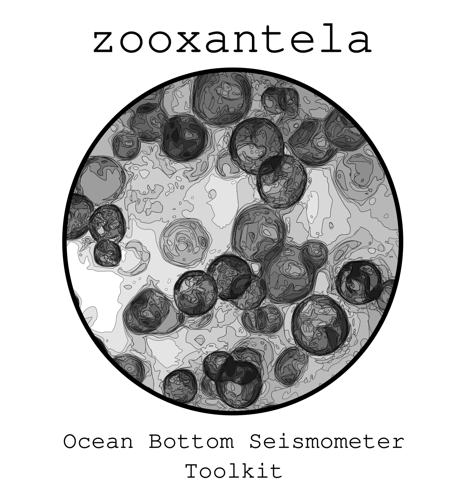

  

This project is dedicated to provide a Python framework for analysing seismological data from ocean-bottom seismometer (OBS) based on [ObsPy](https://github.com/obspy/obspy/wiki).

# References

- M. Beyreuther, R. Barsch, L. Krischer, T. Megies, Y. Behr and J. Wassermann (2010).
ObsPy: A Python Toolbox for Seismology.
*SRL*, **81(3)**, 530-533. DOI: 10.1785/gssrl.81.3.530

- L. Krischer, T. Megies, R. Barsch, M. Beyreuther, T. Lecocq, C. Caudron, J. Wassermann (2015).
ObsPy: a bridge for seismology into the scientific Python ecosystem.
*Computational Science & Discovery*, **8(1)**, 014003. DOI: 10.1088/1749-4699/8/1/014003

 
