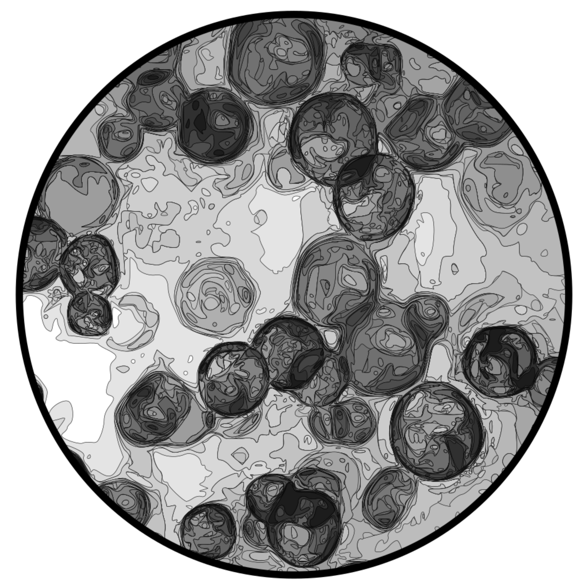

  

This project is dedicated to provide a Python framework for analysing seismological data from ocean-bottom seismometer (OBS) based on [ObsPy](https://github.com/obspy/obspy/wiki).

### What is ZooxantelaPy ?

ZooxantelaPy is a toolkit in [PYTHON](https://www.python.org/) for processing ocean bottom seismometer data.

The seismic events from ocean subsurface is a key component for understanding the of the Earth's dynamic interior. It thus needs a continuous monitoring to help scientists better understand its dynamic and predict its evolution. All around the world, seismologists want to join their efforts and set up a global monitoring.

Our code used the followed libraries:

- [Numpy](http://www.numpy.org/);
- [Matplotlib](http://matplotlib.org/);
- [Snuffler](https://pyrocko.org/docs/current/apps/snuffler/);
- [ObsPy](https://docs.obspy.org/);
- [Multiprocessing](https://docs.python.org/3/library/multiprocessing.html).

### Fetching OBS data

*MiniSEED* is a stripped down version of SEED containing only waveform data. There is no station and channel metadata included In particular, such as geographic coordinates, response/scale and other useful information for interpreting data values.
Time series are values independently fixed length data, each containing a small segment of length values.

A miniSEED reader is necessary to reconstruct the time series, in this case use [OBSPY](https://docs.obspy.org/) to read the files generated by the [GCF2MSD](https://www.guralp.com/sw/gcf2msd.shtml) program from Guralp. A miniSEED “File” or “Stream” is simply a concatenation of data records. The OBS data were organized according to how the data from the Brazilian Seismographic Network [RSBR](http://rsbr.gov.br/). The dataset is divided according to the sensor components, where each folder contains 1-day-sized files that have already been preprocessed. 

*StationXML is an XML representation of metadata that describes the data collected by geophysical instrumentation. StationXML was developed through the International Federation of Digital Seismograph Networks (FDSN) to provide a standardized format for geophysical metadata.

### ToDo list

- [x] Create a web-documentation
- [ ] ...
- [ ] ...
- [ ] When all tasks are complete :tada:
